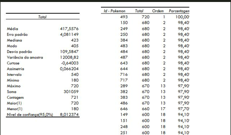
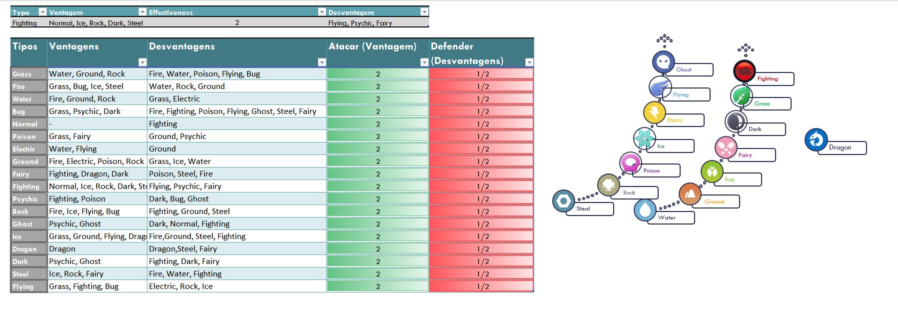
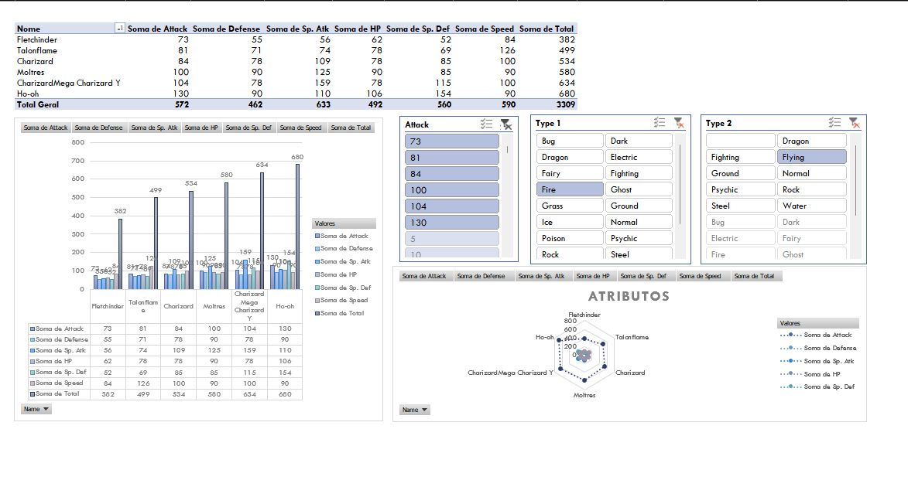
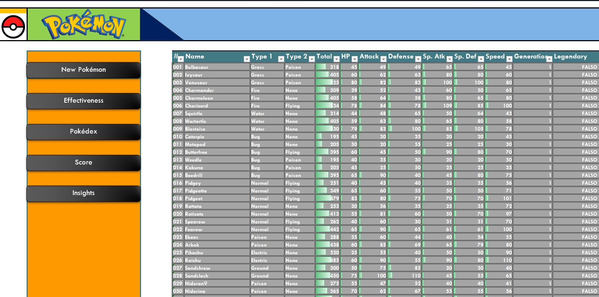
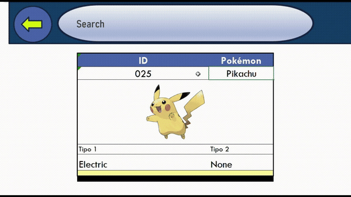

<h1>
    
    Data Analysis Project
</h1>

Este repositório contém uma análise de dados realizada utilizando o Excel, aplicando técnicas como análise descritiva, ordem e percentil, smart art, gráficos e tabelas dinâmicas. O projeto teve como objetivo responder a várias hipóteses formuladas no início da análise.

Utilizei funções avançadas do Excel, incluindo segmentação de dados, formatação condicional, validação de dados, gráficos dinâmicos e tabelas dinâmicas para explorar o conjunto de dados e apresentar os resultados de forma visual.

## Análise Descritiva, Ordem e Percentil

Na análise descritiva, foram calculadas métricas como média, mediana, moda e desvio padrão para obter um entendimento geral sobre os dados. Também foi aplicada a ordenação e cálculo de percentis para entender a distribuição e classificação dos valores.

**Exemplo de métricas calculadas:**

- Média: 417
- Mediana: 423
- Desvio padrão: 109

Apartir dessa metricas conseguimos denotar quais pokemons estão entre o limiar inferior e o superior consequentemente.

Para calcular os percentis, utilizei em Dados > Análise de Dados > Ordem e Percentil do Excel:

## Smart Art

A visualização do fluxo de análise foi representada usando **Smart Art** no Excel, para organizar e ilustrar os passos principais e suas interconexões.

## Gráficos e Tabelas Dinâmicas

Os dados foram visualizados através de gráficos e tabelas dinâmicas, que facilitaram a análise e identificação de padrões e tendências. Entre os gráficos criados, estão gráficos de barras, gráficos de linhas e gráficos de dispersão.

**Exemplo de Gráfico de Barras:**

As **tabelas dinâmicas** permitiram a análise interativa dos dados, segmentando variáveis e aplicando filtros personalizados de maneira eficiente.

## Dataset Estilizado

Para melhorar a legibilidade e a interação com os dados no Excel, o dataset foi estilizado usando formatação condicional, validação de dados, e segmentação de dados. Esses recursos destacaram automaticamente os valores críticos e garantiram a integridade dos dados.

## Demonstração Visual com GIF

Aqui está um GIF demonstrando o uso das principais funcionalidades no Excel, incluindo a interação com gráficos e tabelas dinâmicas:

## Como Contribuir

Se você deseja contribuir com este projeto, siga os passos abaixo:

1. Faça um fork do repositório
2. Crie um branch para sua feature (`git checkout -b minha-feature`)
3. Faça commit das suas alterações (`git commit -m 'Adicionando nova feature'`)
4. Faça push para o branch (`git push origin minha-feature`)
5. Abra um Pull Request

Fico à disposição para revisar e integrar novas contribuições!

<h2>Link para o Projeto: <h4><a href= "Source/pokemon_sheet.xlsx" align="left" alt="projeto">Data Analysis Project
</a></h4></h2>
